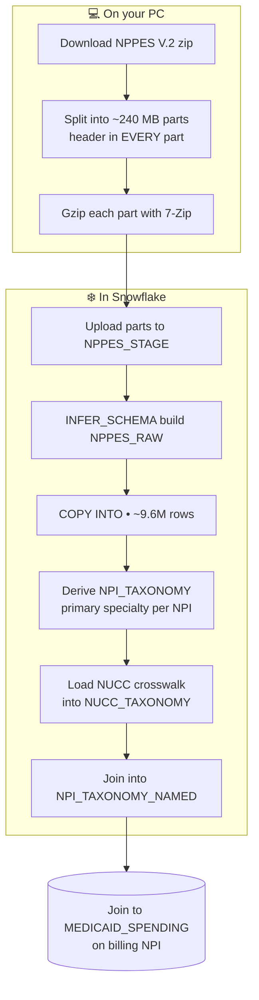

# ❄️ NPPES → Snowflake Load Guide


> Load the national provider registry (**NPPES**) into Snowflake and turn it into a clean
> **NPI → specialty** lookup you can join to Medicaid claims for peer‑group analysis.

Browser‑only Snowflake environment. No CLI or connectors required.

---

## 📦 What you end up with

| Table | What it is | One row per… |
| --- | --- | --- |
| `MEDICAID.REF.NPPES_RAW` | The full provider file, all 330 columns, untouched | Provider (~9.6M) |
| `MEDICAID.REF.NUCC_TAXONOMY` | Code → specialty‑name dictionary | Taxonomy code (~880) |
| **`MEDICAID.REF.NPI_TAXONOMY_NAMED`** | **The finished lookup** — NPI + specialty code + plain name | NPI |

`NPI_TAXONOMY_NAMED` is the one you join to billing NPIs.

---

## 🗺️ The pipeline at a glance



---

## 🧰 Before you start

- Snowflake access to database `MEDICAID` (can create schema, stage, table)
- **7‑Zip** installed
- **PowerShell**
- ~15 GB free disk (the raw CSV is large)

---

## 1️⃣ Download NPPES

Get the monthly **NPPES Data Dissemination** file (Version 2) from CMS:

🔗 `https://download.cms.gov/nppes/NPI_Files.html`

- ~1 GB zip → ~10 GB CSV → ~9.6M rows, 330 columns
- Unzip it. The file you want is the big one: **`npidata_pfile_*.csv`**

---

## 2️⃣ Split + zip the file (on your PC)

**Why:** the CSV is far too big for one browser upload.
Split it into ~240 MB parts, put the **header row in every part**, then gzip each one.

> ⚠️ Do this in a normal folder (e.g. `Downloads`), **not** OneDrive — sync throttles the writes and locks files.

<details>
<summary>📜 Reference PowerShell splitter (click to expand)</summary>

```powershell
# ---- CONFIG ----
$src      = "C:\path\to\npidata_pfile.csv"                 # the big NPPES CSV
$outDir   = "C:\Users\<you>\Downloads\NPPES_split250"      # NOT OneDrive
$maxBytes = 240MB
$sevenZip = "C:\Program Files\7-Zip\7z.exe"

New-Item -ItemType Directory -Force -Path $outDir | Out-Null

$reader = [System.IO.StreamReader]::new($src)
$header = $reader.ReadLine()          # first line = header (BOM auto-stripped on read)
$enc    = [System.Text.UTF8Encoding]::new($false)   # write WITHOUT a BOM

$part = 0; $writer = $null; $bytes = 0

function New-Part($n) {
    $path = Join-Path $outDir ("NPPES_part{0:D3}.csv" -f $n)
    $w = [System.IO.StreamWriter]::new($path, $false, $enc)
    $w.WriteLine($header)             # header goes in EVERY part
    return $w
}

$writer = New-Part (++$part)
while (($line = $reader.ReadLine()) -ne $null) {
    if ($bytes -ge $maxBytes) {
        $writer.Close()
        $writer = New-Part (++$part)
        $bytes = 0
    }
    $writer.WriteLine($line)
    $bytes += $enc.GetByteCount($line) + 2
}
$writer.Close(); $reader.Close()

# ---- gzip each part, then delete the raw .csv ----
Get-ChildItem $outDir -Filter *.csv | ForEach-Object {
    Start-Process -FilePath $sevenZip `
        -ArgumentList "a","-tgzip","$($_.FullName).gz","$($_.FullName)" `
        -Wait -NoNewWindow
    Remove-Item $_.FullName -Force
}
```

</details>

**Result:** `NPPES_part001.csv.gz`, `NPPES_part002.csv.gz`, … (~22 MB each)

Confirm you have only `.gz` files left:

```powershell
Get-ChildItem "$outDir\*.csv.gz" | Measure-Object   # = your part count
Get-ChildItem "$outDir\*.csv"    | Measure-Object   # = 0
```

---

## 3️⃣ Set up Snowflake (run once)

```sql
CREATE SCHEMA IF NOT EXISTS MEDICAID.REF;
CREATE STAGE  IF NOT EXISTS MEDICAID.REF.NPPES_STAGE;

CREATE OR REPLACE FILE FORMAT MEDICAID.REF.NPPES_CSV
  TYPE = CSV
  PARSE_HEADER = TRUE                 -- read column names from the header
  FIELD_OPTIONALLY_ENCLOSED_BY = '"'  -- fields are wrapped in quotes
  SKIP_BYTE_ORDER_MARK = TRUE         -- ignore the hidden BOM at file start
  ERROR_ON_COLUMN_COUNT_MISMATCH = FALSE;
```

Plain terms: **schema** = a folder, **stage** = the upload area, **file format** = the rules for reading the CSV.

---

## 4️⃣ Upload the parts

Snowsight → open `NPPES_STAGE` → **Upload** → select **all** `.gz` parts.
Gzip is auto‑detected, so nothing else to set.

Check they all landed:

```sql
LIST @MEDICAID.REF.NPPES_STAGE;
```

---

## 5️⃣ Build the wide table (auto‑detect 330 columns)

No hand‑typing — Snowflake reads the header and builds the columns for you.

```sql
CREATE OR REPLACE TABLE MEDICAID.REF.NPPES_RAW
USING TEMPLATE (
  SELECT ARRAY_AGG(OBJECT_CONSTRUCT(*))
  FROM TABLE(
    INFER_SCHEMA(
      LOCATION    => '@MEDICAID.REF.NPPES_STAGE',
      FILE_FORMAT => 'MEDICAID.REF.NPPES_CSV'
    )
  )
);
```

---

## 6️⃣ Load the data

```sql
COPY INTO MEDICAID.REF.NPPES_RAW
FROM @MEDICAID.REF.NPPES_STAGE
FILE_FORMAT = (FORMAT_NAME = 'MEDICAID.REF.NPPES_CSV')
MATCH_BY_COLUMN_NAME = CASE_INSENSITIVE
ON_ERROR = CONTINUE;
```

Every file should show status **LOADED** with `0` errors. Then confirm the count:

```sql
SELECT COUNT(*) FROM MEDICAID.REF.NPPES_RAW;   -- expect ~9,600,000
```

---

## 7️⃣ Make the NPI → specialty lookup

Each provider can list up to **15** specialties. One is flagged as their main one
(`...Switch = 'Y'`). This picks that primary one, or falls back to slot 1.

```sql
CREATE OR REPLACE TABLE MEDICAID.REF.NPI_TAXONOMY AS
SELECT "NPI" AS npi,
  COALESCE(
    CASE WHEN "Healthcare Provider Primary Taxonomy Switch_1"  = 'Y' THEN "Healthcare Provider Taxonomy Code_1"  END,
    CASE WHEN "Healthcare Provider Primary Taxonomy Switch_2"  = 'Y' THEN "Healthcare Provider Taxonomy Code_2"  END,
    CASE WHEN "Healthcare Provider Primary Taxonomy Switch_3"  = 'Y' THEN "Healthcare Provider Taxonomy Code_3"  END,
    CASE WHEN "Healthcare Provider Primary Taxonomy Switch_4"  = 'Y' THEN "Healthcare Provider Taxonomy Code_4"  END,
    CASE WHEN "Healthcare Provider Primary Taxonomy Switch_5"  = 'Y' THEN "Healthcare Provider Taxonomy Code_5"  END,
    CASE WHEN "Healthcare Provider Primary Taxonomy Switch_6"  = 'Y' THEN "Healthcare Provider Taxonomy Code_6"  END,
    CASE WHEN "Healthcare Provider Primary Taxonomy Switch_7"  = 'Y' THEN "Healthcare Provider Taxonomy Code_7"  END,
    CASE WHEN "Healthcare Provider Primary Taxonomy Switch_8"  = 'Y' THEN "Healthcare Provider Taxonomy Code_8"  END,
    CASE WHEN "Healthcare Provider Primary Taxonomy Switch_9"  = 'Y' THEN "Healthcare Provider Taxonomy Code_9"  END,
    CASE WHEN "Healthcare Provider Primary Taxonomy Switch_10" = 'Y' THEN "Healthcare Provider Taxonomy Code_10" END,
    CASE WHEN "Healthcare Provider Primary Taxonomy Switch_11" = 'Y' THEN "Healthcare Provider Taxonomy Code_11" END,
    CASE WHEN "Healthcare Provider Primary Taxonomy Switch_12" = 'Y' THEN "Healthcare Provider Taxonomy Code_12" END,
    CASE WHEN "Healthcare Provider Primary Taxonomy Switch_13" = 'Y' THEN "Healthcare Provider Taxonomy Code_13" END,
    CASE WHEN "Healthcare Provider Primary Taxonomy Switch_14" = 'Y' THEN "Healthcare Provider Taxonomy Code_14" END,
    CASE WHEN "Healthcare Provider Primary Taxonomy Switch_15" = 'Y' THEN "Healthcare Provider Taxonomy Code_15" END,
    "Healthcare Provider Taxonomy Code_1"
  ) AS specialty
FROM MEDICAID.REF.NPPES_RAW;
```

Check there are no duplicate NPIs — this **must return 0**:

```sql
SELECT COUNT(*) - COUNT(DISTINCT npi) AS dupes
FROM MEDICAID.REF.NPI_TAXONOMY;
```

---

## 8️⃣ Add plain‑English specialty names (NUCC crosswalk)

Right now `specialty` is a code like `207Q00000X`.
The NUCC file turns it into **"Family Medicine."**

**Download:** `nucc.org` → **Code Sets** → **Health Care Provider Taxonomy Code Set** → **CSV**
Get the **Taxonomy** file (`nucc_taxonomy_*.csv`) — *not* the "Characteristics" one.
It's small (~880 rows), so no splitting or gzip.

```sql
CREATE STAGE IF NOT EXISTS MEDICAID.REF.NUCC_STAGE;
-- Snowsight: upload nucc_taxonomy_XXX.csv into NUCC_STAGE, then:

CREATE OR REPLACE TABLE MEDICAID.REF.NUCC_TAXONOMY
USING TEMPLATE (
  SELECT ARRAY_AGG(OBJECT_CONSTRUCT(*))
  FROM TABLE(
    INFER_SCHEMA(
      LOCATION    => '@MEDICAID.REF.NUCC_STAGE',
      FILE_FORMAT => 'MEDICAID.REF.NPPES_CSV'   -- same rules work fine
    )
  )
);

COPY INTO MEDICAID.REF.NUCC_TAXONOMY
FROM @MEDICAID.REF.NUCC_STAGE
FILE_FORMAT = (FORMAT_NAME = 'MEDICAID.REF.NPPES_CSV')
MATCH_BY_COLUMN_NAME = CASE_INSENSITIVE
ON_ERROR = CONTINUE;
```

**Join** the code to its name:

```sql
CREATE OR REPLACE TABLE MEDICAID.REF.NPI_TAXONOMY_NAMED AS
SELECT n.npi,
       n.specialty                                     AS specialty_code,
       COALESCE(NULLIF(TRIM(t."Display Name"), ''),
                t."Classification")                    AS specialty_name,
       t."Classification"                              AS specialty_group
FROM MEDICAID.REF.NPI_TAXONOMY n
LEFT JOIN MEDICAID.REF.NUCC_TAXONOMY t
       ON n.specialty = t."Code";
```

**Confirm it worked:**

```sql
SELECT specialty_name, COUNT(*) AS providers
FROM MEDICAID.REF.NPI_TAXONOMY_NAMED
GROUP BY specialty_name
ORDER BY providers DESC
LIMIT 15;
```

✅ You should see real names (Behavior Technician, Clinical Social Worker, Pharmacist…) instead of codes.

**`NPI_TAXONOMY_NAMED` is the finished lookup.**

---

## 🔁 Refreshing next month

NPPES publishes a new file every month. To reload with a fresh one:

```sql
TRUNCATE TABLE MEDICAID.REF.NPPES_RAW;   -- empty the table
REMOVE @MEDICAID.REF.NPPES_STAGE;        -- clear old staged files
```

The schema and file format stay — no need to rebuild them.
Then repeat steps **2 → 4 → 6 → 7 → 8**.

---

## 🧯 Gotchas (save yourself the pain)

| Symptom | Cause | Fix |
| --- | --- | --- |
| Rows missing / columns don't line up on parts 2+ | Header only in the first part | Put the header row in **every** split part |
| First column looks like `NPI` but joins silently fail | UTF‑8 **BOM** at the start of the file | `SKIP_BYTE_ORDER_MARK = TRUE` in the file format |
| Splitting/gzipping is slow or files get locked | Working inside a **OneDrive** folder | Split in a local folder (e.g. `Downloads`) |
| Snowflake won't auto‑detect the archive | Used `Compress-Archive` (makes `.zip`) | Use **7‑Zip → gzip** (`.gz`) |
| Row counts **doubled** after a reload | `part.csv` and `part.csv.gz` are different names to `COPY` | `TRUNCATE` + `REMOVE` before reloading |
| `Remove-Item … used by another process` | 7‑Zip / antivirus / Explorer preview still holds the file | Add `-Wait` to 7‑Zip, retry the delete, exclude the folder from AV |
| Specialty names come back blank | Loaded the NUCC **Characteristics** file by mistake | Use the **Provider Taxonomy** CSV (`nucc_taxonomy_*.csv`) |

---

## 📖 Quick glossary

- **Address format:** `DATABASE.SCHEMA.TABLE` — like a folder path (`MEDICAID` → `REF` → `NPPES_RAW`).
- **`NPPES_RAW`** = raw source (backup). **`NUCC_TAXONOMY`** = code→name dictionary. **`NPI_TAXONOMY_NAMED`** = the lookup you use.
- **Specialty code** = a 10‑character NUCC taxonomy code (e.g. `207Q00000X` = Family Medicine).
- **NPI** = the provider's national ID number.

---

## 🔗 Sources

- **NPPES Data Dissemination (V.2):** `https://download.cms.gov/nppes/NPI_Files.html`
- **NUCC Provider Taxonomy CSV:** `https://nucc.org/index.php/code-sets-mainmenu-41/provider-taxonomy-mainmenu-40/csv-mainmenu-57`
