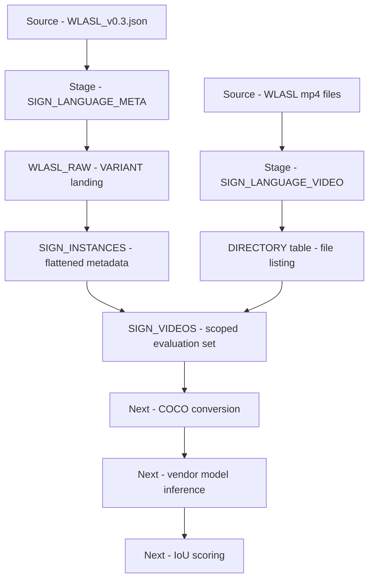

[README.md](https://github.com/user-attachments/files/31035842/README.md)
# Sign Language Video Ingestion Pipeline — Snowflake

A **Snowflake-native ingestion pipeline** that loads WLASL sign language video data and its COCO-style annotations into queryable Delta-equivalent structures. Unstructured video is staged with a **directory table**; nested JSON metadata is flattened via **LATERAL FLATTEN**; the two are joined into a scoped evaluation set with verified ground-truth bounding boxes.

---

## Quick Look

- **What this demonstrates:** unstructured data handling in Snowflake, semi-structured JSON parsing, staged file management, raw → parsed → scoped layering, and ground-truth preparation for model evaluation.
- **Tech:** Snowflake, SQL, Snowflake Notebooks, VARIANT / LATERAL FLATTEN, directory tables, WLASL dataset.
- **Outputs:** curated tables (`WLASL_RAW`, `SIGN_INSTANCES`, `SIGN_VIDEOS`) ready for vendor model evaluation and IoU scoring.

---

## Architecture



---

## Data Model

| Object | Type | Purpose |
|---|---|---|
| `SIGN_LANGUAGE_META` | Stage | Holds `WLASL_v0.3.json`. Staging is required because `COPY INTO` can only read from a stage. |
| `SIGN_LANGUAGE_VIDEO` | Stage (directory enabled) | Holds the mp4 bytes. Tables cannot store video; the directory table makes stage contents queryable in SQL. |
| `WLASL_RAW` | Table | Single VARIANT column, one row per gloss. Landing zone — Snowflake cannot parse and flatten staged JSON in one step. |
| `SIGN_INSTANCES` | Table | One row per video instance with typed columns. The full WLASL catalog, including instances whose video files are unavailable. |
| `SIGN_VIDEOS` | Table | `SIGN_INSTANCES` joined to files that actually exist on the stage. Defines the real evaluation scope. |

---

## Step 1 — Create the database and schema

```sql
CREATE DATABASE IF NOT EXISTS sign_language_db;
CREATE SCHEMA IF NOT EXISTS sign_language_db.raw;

USE DATABASE sign_language_db;
USE SCHEMA raw;
```

---

## Step 2 — Create the stages

The metadata stage holds the annotation JSON. The video stage requires `DIRECTORY = (ENABLE = TRUE)` so stage contents can be queried from SQL, and `SNOWFLAKE_SSE` encryption so presigned URLs can stream in a browser.

```sql
CREATE STAGE IF NOT EXISTS sign_language_meta;

CREATE STAGE IF NOT EXISTS sign_language_video
  DIRECTORY = (ENABLE = TRUE)
  ENCRYPTION = (TYPE = 'SNOWFLAKE_SSE');
```

Without `DIRECTORY = (ENABLE = TRUE)` there is no SQL-side way to know which files are present, and the join in Step 6 is impossible.

---

## Step 3 — Upload the source files

**Snowsight UI:** Data → `SIGN_LANGUAGE_DB` → `RAW` → Stages → select stage → **+ Files**. Leave the folder path blank so files land at the stage root — a folder prefix changes `relative_path` and breaks the filename join.

**Bulk upload via SnowSQL:**

```sql
PUT file:///path/to/wlasl/videos/*.mp4 @sign_language_video AUTO_COMPRESS=FALSE;
PUT file:///path/to/WLASL_v0.3.json @sign_language_meta;
```

`AUTO_COMPRESS=FALSE` is required for the videos — otherwise Snowflake gzips them and they will not stream.

Refresh and verify:

```sql
ALTER STAGE sign_language_video REFRESH;

SELECT * FROM DIRECTORY(@sign_language_video);
```

---

## Step 4 — Load the JSON into a landing table

```sql
CREATE OR REPLACE TABLE wlasl_raw (v VARIANT);

COPY INTO wlasl_raw
FROM @sign_language_meta/WLASL_v0.3.json
FILE_FORMAT = (TYPE = JSON, STRIP_OUTER_ARRAY = TRUE);

SELECT COUNT(*) FROM wlasl_raw;
```

`STRIP_OUTER_ARRAY = TRUE` yields one row per gloss rather than a single row containing the entire array.

---

## Step 5 — Flatten to typed columns

WLASL nests an `instances` array inside each gloss object. `LATERAL FLATTEN` expands that array into one row per video instance.

```sql
CREATE OR REPLACE TABLE sign_instances AS
SELECT
    r.v:gloss::STRING                     AS gloss,
    i.value:video_id::STRING              AS video_id,
    i.value:video_id::STRING || '.mp4'    AS file_name,
    i.value:signer_id::INT                AS signer_id,
    i.value:split::STRING                 AS split,
    i.value:fps::INT                      AS fps,
    i.value:frame_start::INT              AS frame_start,
    i.value:frame_end::INT                AS frame_end,
    i.value:bbox::ARRAY                   AS bbox,
    i.value:source::STRING                AS source
FROM wlasl_raw r,
     LATERAL FLATTEN(input => r.v:instances) i;
```

The derived `file_name` column exists solely to join against `relative_path` in the next step.

---

## Step 6 — Join metadata to available files

```sql
CREATE OR REPLACE TABLE sign_videos AS
SELECT
    s.*,
    d.relative_path,
    d.size
FROM sign_instances s
JOIN DIRECTORY(@sign_language_video) d
  ON d.relative_path = s.file_name;
```

Verify the join landed and that glosses vary:

```sql
SELECT COUNT(*) AS metadata_rows FROM sign_instances;
SELECT COUNT(*) AS with_files    FROM sign_videos;
SELECT gloss, COUNT(*) FROM sign_videos GROUP BY gloss;
```

The gap between `metadata_rows` and `with_files` is a real finding — the public WLASL video set is incomplete because many source links have gone dead.

---

## Step 7 — Convert bounding boxes to COCO format

WLASL stores `[x_min, y_min, x_max, y_max]`. COCO uses `[x, y, width, height]`. Comparing the two directly produces boxes that overflow the frame.

```sql
SELECT
    gloss,
    video_id,
    bbox[0]::INT                 AS x,
    bbox[1]::INT                 AS y,
    bbox[2]::INT - bbox[0]::INT  AS width,
    bbox[3]::INT - bbox[1]::INT  AS height
FROM sign_videos
ORDER BY gloss;
```

---

## Result

| Gloss | Video ID | Split | BBox (x_min, y_min, x_max, y_max) |
|---|---|---|---|
| abdomen | 00336 | train | 103, 0, 565, 480 |
| accident | 00639 | train | 180, 45, 574, 400 |
| adult | 01209 | train | 620, 70, 1619, 1070 |
| afternoon | 01436 | test | 115, 21, 547, 480 |
| algebra | 01876 | train | 99, 16, 540, 480 |

---

## Notes and Caveats

- **Bounding boxes are absolute pixels.** Source resolution varies across clips — `adult` is roughly 1920×1080 while the others are near 576×480. Coordinates must be normalized by frame dimensions before any cross-video comparison.
- **One box per clip, not per frame.** WLASL provides a single static signer box for an entire video. If a model returns per-frame detections, the aggregation rule (mean IoU across frames vs. IoU against the union) must be defined explicitly before scoring.
- **Split distribution is uneven** in this sample — four train, one test. Acceptable for validating the pipeline; not acceptable as a basis for reported accuracy.
- **Presigned URLs expire.** `BUILD_STAGE_FILE_URL` results should be generated at query time rather than persisted in a table.

---

## Next Steps

- [ ] Normalize bounding boxes against source video dimensions
- [ ] Resolve outbound network access for external model API calls
- [ ] Evaluate S3 external stage as an alternate integration path
- [ ] Define IoU aggregation rule for per-frame video predictions
- [ ] Write predictions back to Snowflake and score against `sign_videos`
